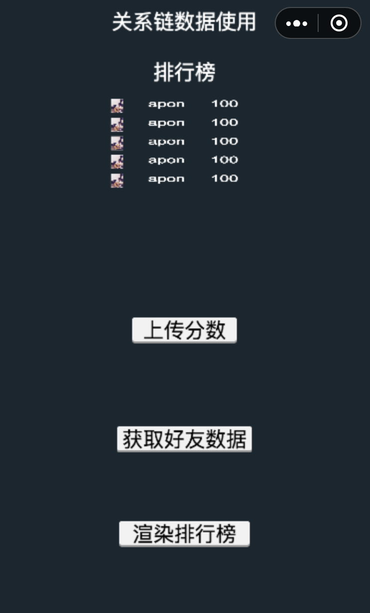

# 关于微信小游戏关系链数据的demo
这是一个Cocos Creator项目，一个关于微信小游戏关系链数据的demo。

使用Cocos Creator开发微信小游戏如何实现类似跳一跳的好友排行以及群排行？

官方有给出[关系链数据使用指南](https://developers.weixin.qq.com/minigame/dev/tutorial/open-ability/open-data.html?t=201832)。根据文档可知，为了保护关系链数据，小游戏开辟了一个开放数据域（一个封闭、独立的 JavaScript 作用域），获取关系链数据的代码只能在开放域中运行。game.js 是整个游戏的入口文件，其代码运行在主域。主域可以向开放数据域发送消息，而开放数据域不能向主域发送消息。主域和开放数据域都可以访问的一个叫sharedCanvas离屏画布。

根据已有条件，实现好友排行要：
1. 主域向开放数据域发送获取好友数据的请求（通过postMessage发送消息）
2. 开放数据域接收到请求（通过onMessage接收）后调用api（wx.getUserCloudStorage、wx.getFriendCloudStorage 和 wx.getGroupCloudStorage）向微信服务器请求数据
3. 在开放数据域获取到关系链数据后将数据画到sharedCanvas
4. 在主域获取sharedCanvas做渲染


运行本项目要先改配置
在game.json添加
```
"openDataContext": "src/myOpenDataContext"
```
把myOpenDataContext复制到src。

截图




